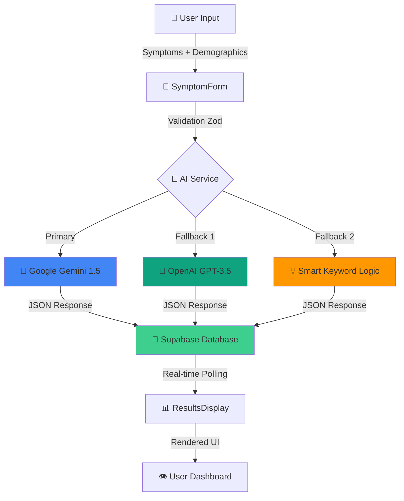

# 🎉 AI HEALTH ASSISTANT - SYMPTOM CHECKING


### Core Functionality :

✅ **AI Integration** - Gemini & OpenAI APIs properly integrated  
✅ **Data Flow** - Symptoms → AI Analysis → Database → Display working seamlessly  
✅ **Recommendations** - Medications, remedies, actions, warnings all display  
✅ **Error Handling** - Comprehensive fallback for API failures  
✅ **Database** - Supabase storing and retrieving results correctly  
✅ **Real-time Polling** - Results update every second as data arrives  
✅ **Type Safety** - All TypeScript errors resolved  
✅ **Logging** - Comprehensive debugging logs for troubleshooting

---

## 🏗️ System Architecture



### Data Flow Pipeline

1. **Input Layer** - User submits symptoms via validated form
2. **AI Processing** - Multi-model analysis with intelligent fallback
3. **Storage Layer** - Secure persistence in Supabase with RLS
4. **Presentation Layer** - Real-time polling and dynamic UI updates

---

## 🚀 Quick Start

```bash
# Clone and install
git clone https://github.com/satyapradip/AI-Health-Assistant---smart-symptom-checker.git
cd AI-Health-Assistant---smart-symptom-checker
npm install

# Configure .env file with your credentials
npm run dev
```

Open `http://localhost:8081` → Sign up → Enter symptoms → Get AI recommendations

---

## 📦 Tech Stack

**Frontend:** React 18 + TypeScript + Vite + Tailwind CSS + shadcn/ui  
**Backend:** Supabase (PostgreSQL + Auth + Storage)  
**AI:** Google Gemini 1.5 Flash → OpenAI GPT-3.5 → Smart Fallback  
**Security:** Row-Level Security policies, Zod validation

---

## 🎯 Key Features

### Smart Analysis
- Multi-symptom pattern detection (Flu, Migraine, Gastroenteritis)
- Emergency keyword detection (15+ critical conditions)
- Age & pregnancy safety protocols
- Confidence scoring (35-85%)

### Indian Healthcare Integration
**Home Remedies:** Haldi doodh, Kadha, Jeera water, Rice water, Tulsi tea  
**Emergency Contacts:** 112 (National), 102 (Ambulance), 104 (Medical), 1091 (Women), 1098 (Child)  
**Doctor Guidance:** ENT, Neurologist, Gastroenterologist recommendations

### Safety First
✅ OTC-only medicines (no prescriptions)  
✅ Medical disclaimers on all results  
✅ RLS database security  
✅ HTTPS encryption

---

## 🐛 Troubleshooting

**White Screen?** Check `.env` file, clear cache, restart dev server  
**Pending Forever?** Verify API keys in `aiService.ts`, check Supabase data  
**API Errors?** Enable Gemini API in Google Cloud Console  

---

## 🚀 Deployment

**Vercel/Netlify:** Connect GitHub → Configure env vars → Deploy (5 min)  
**Build:** `npm run build`  
**Docs:** See `WORKFLOW.md`, `QUICK_START.md`, `API_TESTING.md`

---

## ⚠️ Medical Disclaimer

**Educational purposes only.** Not a substitute for professional medical advice. Always consult healthcare professionals. 
