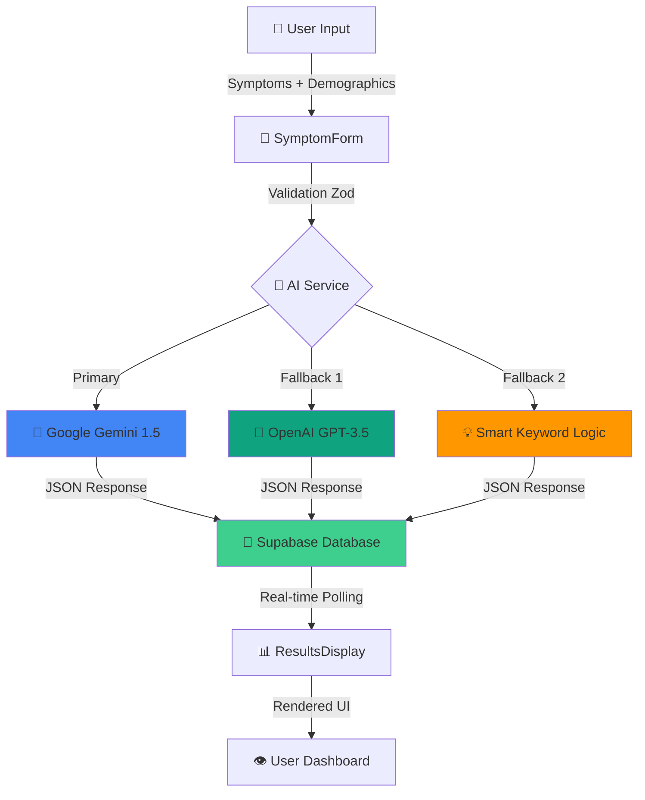

# 🎉 AI HEALTH ASSISTANT - SYMPTOM CHECKING

[](https://ai-health-assistant-smart-symptom-c.vercel.app/)

## Core Functionality

✅ **AI Integration** - Gemini & OpenAI APIs properly integrated  
✅ **Data Flow** - Symptoms → AI Analysis → Database → Display working seamlessly  
✅ **Recommendations** - Medications, remedies, actions, warnings all display  
✅ **Error Handling** - Comprehensive fallback for API failures  
✅ **Database** - Supabase storing and retrieving results correctly  
✅ **Real-time Polling** - Results update every second as data arrives  
✅ **Type Safety** - All TypeScript errors resolved  
✅ **Logging** - Comprehensive debugging logs for troubleshooting

---

## 🏗️ System Architecture



### Data Flow Pipeline

1. **Input Layer** - User submits symptoms via validated form
2. **AI Processing** - Multi-model analysis with intelligent fallback
3. **Storage Layer** - Secure persistence in Supabase with RLS
4. **Presentation Layer** - Real-time polling and dynamic UI updates

---

## 🚀 Quick Start

```bash
# Clone and install
git clone https://github.com/satyapradip/AI-Health-Assistant---smart-symptom-checker.git
cd AI-Health-Assistant---smart-symptom-checker
npm install

# Configure .env file with your credentials
npm run dev
```

Open `http://localhost:8081` → Sign up → Enter symptoms → Get AI recommendations

---

## 📦 Tech Stack

**Frontend:** React 18 + TypeScript + Vite + Tailwind CSS + shadcn/ui  
**Backend:** Supabase (PostgreSQL + Auth + Storage)  
**AI:** Google Gemini 1.5 Flash → OpenAI GPT-3.5 → Smart Fallback  
**Security:** Row-Level Security policies, Zod validation

---

## 🎯 Key Features

### Smart Analysis
- Multi-symptom pattern detection (Flu, Migraine, Gastroenteritis)
- Emergency keyword detection (15+ critical conditions)
- Age & pregnancy safety protocols
- Confidence scoring (35-85%)

### Safety First
✅ OTC-only medicines (no prescriptions)  
✅ Medical disclaimers on all results  
✅ RLS database security  
✅ HTTPS encryption

---
---

## 🚀 Deployment

**Vercel/Netlify:** Connect GitHub → Configure env vars → Deploy (5 min)  
**Build:** `npm run build`  
**Docs:** See `WORKFLOW.md`, `QUICK_START.md`, `API_TESTING.md`

---

## 👥 Contributors

<table>
  <tr>
    <td align="center">
      <a href="https://github.com/satyapradip">
        
        <br />
        <sub><b>Satya Pradip</b></sub>
      </a>
    </td>
    <td align="center">
      <a href="https://github.com/TejaswaniRai">
        
        <br />
        <sub><b>Tejaswani Rai</b></sub>
      </a>
    </td>
  </tr>
</table>

---

## ⚠️ Medical Disclaimer

**Educational purposes only.** Not a substitute for professional medical advice. Always consult healthcare professionals.

---

## 📄 License

This project is licensed under the **MIT License** - see the [LICENSE](LICENSE) file for details.

---

## ⚠️ Medical Disclaimer

<div align="center">

### 🚨 IMPORTANT: READ BEFORE USE

</div>

> **This application is for EDUCATIONAL and INFORMATIONAL purposes only.**

#### ❌ What This App IS NOT:

- ❌ NOT a substitute for professional medical advice
- ❌ NOT for emergency medical situations
- ❌ NOT a diagnostic tool for clinical use
- ❌ NOT endorsed by medical authorities
- ❌ NOT a replacement for doctor consultations

#### ✅ What This App IS:

- ✅ Educational demonstration of AI in healthcare
- ✅ Preliminary symptom assessment tool
- ✅ Health information resource
- ✅ Technology showcase project

#### 🆘 Emergency Situations

**If you experience:**
- Chest pain or pressure
- Difficulty breathing
- Severe bleeding
- Loss of consciousness
- Stroke symptoms (FAST)
- Severe allergic reactions

**🚨 CALL EMERGENCY SERVICES IMMEDIATELY:**
- **India**: 112 (National Emergency)
- **Ambulance**: 102
- **Medical Helpline**: 104

#### 👨‍⚕️ Always Consult Healthcare Professionals

- All recommendations require medical validation
- Never self-diagnose based on app results
- Consult licensed physicians for treatment
- Verify information with qualified practitioners

#### 📜 Liability

The developers assume **NO liability** for:
- Medical decisions based on app output
- Accuracy of AI-generated recommendations
- Health outcomes from using this application
- Delays in seeking professional care

#### 🔒 Privacy Notice

- Your health data is stored securely
- We don't share information with third parties
- Data is encrypted in transit and at rest
- You can request data deletion anytime


---

<div align="center">

### 🏥 Built with ❤️ for Better Healthcare Accessibility

**Making AI-powered healthcare available to everyone, everywhere.**

---

**[⬆ Back to Top](#-ai-health-assistant---smart-symptom-checker)**

</div>
